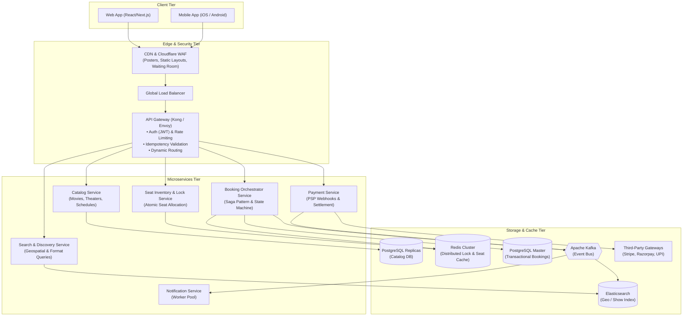
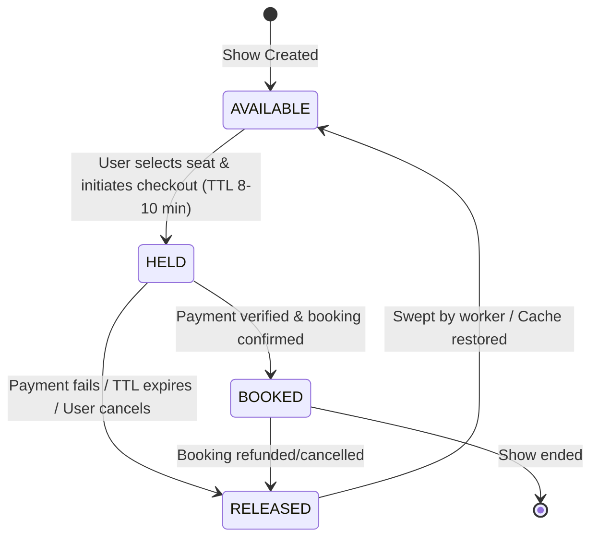

# Movie Booking System (BookMyShow) — High-Level Design (HLD)

[](#system-architecture)
[](#distributed-concurrency--double-booking-prevention)
[](#cap-theorem-trade-off-analysis)
[](#scalability-resilience--monitoring)

A production-grade, highly available, distributed **High-Level Design (HLD)** for a nationwide Movie Ticket Booking Platform (e.g., BookMyShow / Fandango). Designed to serve tens of millions of daily active users (DAU) and gracefully handle massive flash-crowd traffic spikes during blockbuster ticket releases with **zero double-booking guarantees**.

---

## 📑 Table of Contents

1. [System Overview & Requirements](#system-overview--requirements)
2. [System Architecture](#system-architecture)
3. [Repository Deliverables](#repository-deliverables)
4. [Distributed Concurrency & Double-Booking Prevention](#distributed-concurrency--double-booking-prevention)
5. [CAP Theorem Trade-Off Analysis](#cap-theorem-trade-off-analysis)
6. [Core API Specifications](#core-api-specifications)
7. [Data Architecture & Sharding Strategy](#data-architecture--sharding-strategy)
8. [Scalability, Resilience & Monitoring](#scalability-resilience--monitoring)

---

## System Overview & Requirements

### 1. Functional Requirements

- **Browse & Search Shows**: Users can discover movies by geographical location (City/Region), theater amenities, date, language, and screening formats (2D, 3D, IMAX, 4DX).
- **Interactive Seat Map**: Users can view the real-time 2D layout of an auditorium with live seat occupancy (`AVAILABLE`, `HELD`, `BOOKED`).
- **Temporary Seat Hold (Atomic Lock)**: When a user selects seats, the system holds them for **8–10 minutes** to allow checkout completion. No other user can reserve the same seats during this active window.
- **Booking & Payment Settlement**: Orchestrates secure payment processing, generates transactional bookings, and delivers digital tickets with QR codes via asynchronous notifications (Email/SMS/Push).
- **Cancellations & Auto-Release**: Expired seat locks or failed payments automatically return seats to the available inventory in real time.

### 2. Non-Functional Requirements

- **High Concurrency & Zero Double-Booking**: Absolute linearizable consistency during seat reservations. Under no circumstances should two users book the same physical seat for a show.
- **Ultra-Low Latency Browsing**: Catalog and show search queries respond in `< 20ms` via edge caching and distributed read replicas.
- **High Availability (99.999% for Browsing)**: The movie discovery and theater search subsystem must remain operational even during regional data center outages.
- **Fault-Tolerant Checkout**: Multi-step checkout operations are guaranteed idempotent using `Idempotency-Key` headers and transactional rollback mechanisms (Saga pattern).

---

## System Architecture



---

## Repository Deliverables

This repository contains the complete specification and design documentation:

| Deliverable                                                     |   Format   | Description                                                                                                     |
| :-------------------------------------------------------------- | :--------: | :-------------------------------------------------------------------------------------------------------------- |
| **[Architecture Diagram](Architecture_Diagram.pdf)**            |   `PDF`    | End-to-end distributed system architecture, component boundaries, and network topology.                         |
| **[Component Descriptions](Component_Descriptions.pdf)**        |   `PDF`    | Granular responsibilities, communication protocols, and scaling mechanisms for each microservice.               |
| **[API Specifications](API_Specifications.pdf)**                |   `PDF`    | Production REST/gRPC API contracts, payload schemas, query parameters, and error status codes.                  |
| **[CAP Theorem Trade-Offs](CAP_Tradeoffs.pdf)**                 |   `PDF`    | Deep-dive analysis of AP (Availability) vs CP (Consistency) trade-offs across read and write subsystems.        |
| **[Scaling and Monitoring](Scaling_and_Monitoring.pdf)**        |   `PDF`    | Flash-crowd mitigation, virtual queueing, database sharding, and end-to-end observability (Prometheus/Grafana). |

---

## Distributed Concurrency & Double-Booking Prevention

### 1. Seat State Machine

Every show seat transitions through a deterministic state machine:



### 2. Atomic Multi-Seat Reservation (Redis Lua Script)

To avoid race conditions when thousands of users attempt to book the same seats simultaneously during blockbuster releases, seat holds are processed inside **Redis via an atomic Lua script**:

```lua
-- KEYS: Seat identifier keys (e.g., show:101:seat:A1, show:101:seat:A2)
-- ARGV: [1] userId, [2] lockTTL (seconds)

-- 1. Check if ANY requested seat is already locked or booked
for i, key in ipairs(KEYS) do
    local current = redis.call('GET', key)
    if current ~= false then
        return {err = "SEAT_UNAVAILABLE", conflicted_key = key}
    end
end

-- 2. Atomically lock all requested seats with TTL
for i, key in ipairs(KEYS) do
    redis.call('SET', key, ARGV[1], 'EX', ARGV[2])
end

return "OK"
```

### 3. Database Fallback (Optimistic Locking)

In the persistence layer, double-booking prevention is reinforced with versioned optimistic concurrency control:

```sql
UPDATE show_seats
SET status = 'HELD', locked_by = :userId, lock_expires_at = :expiryTime, version = version + 1
WHERE show_id = :showId
  AND seat_id IN (:seatIds)
  AND status = 'AVAILABLE'
  AND version = :expectedVersion;
```

---

## CAP Theorem Trade-Off Analysis

A single CAP label cannot be applied across the entire system. Instead, the architecture is partitioned into distinct sub-domains:

```
+-------------------------------------------------------------------------+
|                              CAP SPECTRUM                               |
+------------------------------------+------------------------------------+
|                AP                  |                 CP                 |
|   (Availability + Partition Tol.)  |  (Consistency + Partition Tol.)    |
+------------------------------------+------------------------------------+
| • Movie Catalog Browsing           | • Seat Hold / Distributed Lock     |
| • Cinema Location Search           | • Booking Finalization             |
| • User Reviews & Recommendations   | • Payment Deduction & Webhooks     |
| • Promotional Banner Distribution  | • Refund Processing                |
+------------------------------------+------------------------------------+
| SLA: 99.999% Availability          | SLA: 100% Linearizable Consistency |
| Trade-off: Eventual Consistency    | Trade-off: Reject booking request  |
| (acceptable lag < 3-5 seconds)     | rather than risk double-booking    |
+------------------------------------+------------------------------------+
```

---

## Core API Specifications

| Method | Endpoint                         | Description                                   | Key Headers / Params            |
| :----- | :------------------------------- | :-------------------------------------------- | :------------------------------ |
| `GET`  | `/v1/shows`                      | Search shows by city, date, format, and movie | `city_id`, `date`, `format`     |
| `GET`  | `/v1/shows/{show_id}/seats`      | Real-time seat map and availability matrix    | `show_id`                       |
| `POST` | `/v1/shows/{show_id}/seats/lock` | Atomically reserve seats with a TTL (8 mins)  | `Idempotency-Key`, `seat_ids`   |
| `POST` | `/v1/bookings/checkout`          | Settle payment and confirm reservation        | `Idempotency-Key`, `lock_token` |
| `GET`  | `/v1/bookings/{booking_id}`      | Fetch booking summary and QR ticket           | `Authorization: Bearer <token>` |

---

## Data Architecture & Sharding Strategy

- **Relational Storage (PostgreSQL)**: Stores ACID-critical entities (`Bookings`, `Payments`, `Shows`, `Cinemas`).
  - **Sharding Key**: Sharded primarily by `city_id` and sub-partitioned by `show_id`. This guarantees that high write volume on a single show in Mumbai does not impact show bookings in Delhi.
- **In-Memory Cache & Lock (Redis Cluster)**:
  - Seat layout bitmasks and transient locks (`show:{id}:seat:{id}`).
  - Redis Sentinel / Cluster setup with read replicas for seat map lookups.
- **Search Engine (Elasticsearch)**:
  - Geo-spatial queries (`geo_distance`) for locating nearby theaters.
  - Multi-attribute filtering (language, IMAX, subtitle availability).
- **Asynchronous Event Stream (Apache Kafka)**:
  - Topics: `booking.created`, `seat.locked`, `seat.released`, `payment.success`, `ticket.dispatched`.
  - Guarantees event ordering per `booking_id` partition key.

---

## Scalability, Resilience & Monitoring

1. **Virtual Waiting Room**:
   - For blockbuster events, traffic spikes are buffered using a token-bucket queue at the Cloudflare / API Gateway edge, admitting only $N$ checkout sessions per second to prevent database saturation.
2. **Idempotency Guarantee**:
   - All booking and payment requests require an `Idempotency-Key` UUID. Gateway caches responses in Redis for 24 hours to prevent duplicate charges upon network retries.
3. **Observability Stack**:
   - **Metrics**: Prometheus scraping service endpoints; Grafana dashboards tracking p95/p99 latency, seat lock conflict rates, and payment gateway failure percentages.
   - **Distributed Tracing**: OpenTelemetry integrated across API Gateway, microservices, and Kafka consumers.
   - **Alerting**: PagerDuty triggers for seat lock failure rates $> 5\%$ or database connection pool saturation $> 80\%$.

---
