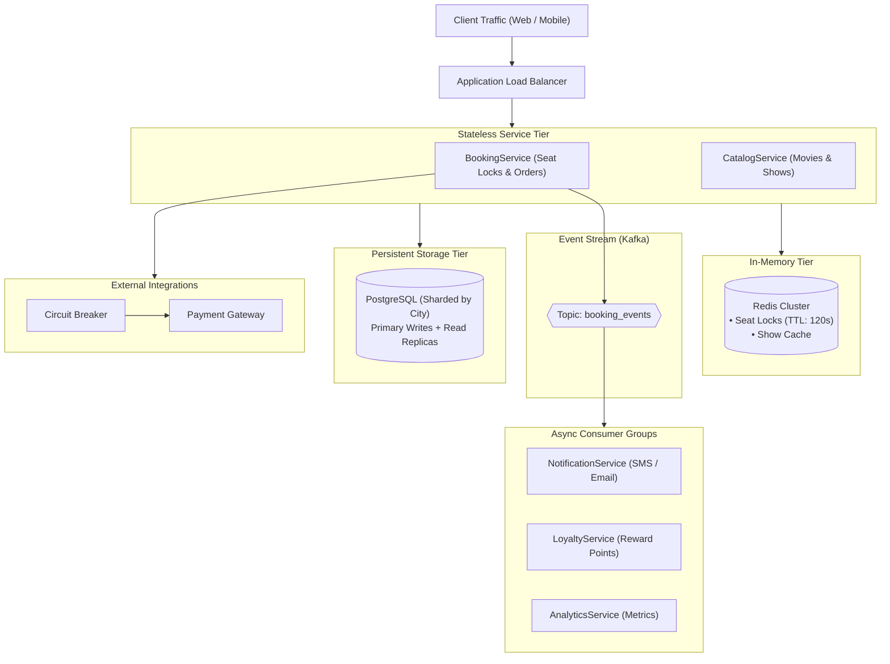

# Movie Booking System — High-Level Design (HLD)

A scalable, fault-tolerant distributed system architecture for a high-concurrency movie ticket booking platform (e.g., BookMyShow). Designed to handle peak flash-crowd traffic during blockbuster releases with zero double-bookings, low-latency browsing, and real-time event-driven notifications.

---

## Architecture Documents

### Complete System Design (`complete-system-design/`)
- **[Requirements & Assumptions Matrix](complete-system-design/Requirements_Table.pdf)** — Functional and non-functional requirements matrix, target SLAs, and operational assumptions.
- **[System Architecture](complete-system-design/Architecture_Diagram.pdf)** — Distributed service topology, synchronous vs. asynchronous paths, and component descriptions.
- **[Data Model & Storage](complete-system-design/ER_Diagram.pdf)** — Entity-relationship schema, composite indexes, and City + Month sharding strategy.
- **[Component Deep Dives](complete-system-design/Component_DeepDives.pdf)** — BookingService seat hold flow, PaymentService 4-stage lifecycle, and NotificationService workers.
- **[Scaling & Trade-Offs](complete-system-design/Scaling_and_TradeOffs.pdf)** — Multi-tier flash traffic defense, hybrid CAP theorem model, and schema trade-offs.
- **[Monitoring & SLOs](complete-system-design/Monitoring_and_SLOs.pdf)** — Production telemetry stack, core KPIs, availability/booking reliability SLOs, and escalation matrix.

### Real-Time Notifications (`realtime-notifications/`)
- **[Pub/Sub Architecture](realtime-notifications/PubSub_Architecture.pdf)** — Kafka event bus topology, producer/consumer mapping, and standard event schemas.
- **[NotificationService Design](realtime-notifications/NotificationService_Design.pdf)** — Multi-channel workers (Email, SMS, Push, WebSockets) with idempotent delivery.
- **[Reminder & Delayed Workflows](realtime-notifications/Reminder_Workflow.pdf)** — Redis ZSET delay queues, atomic dequeue, and advance show reminders.
- **[Failure Handling & Metrics](realtime-notifications/Failure_Handling_and_Metrics.pdf)** — Broker failover, 7-day replay, and 5.0s confirmation latency SLO.
- **[Design Proposal & Summary](realtime-notifications/Design_Explanation.pdf)** — Executive architecture proposal and 4-stage event lifecycle.

### Concurrency & Scaling (`scaling-and-concurrency/`)
- **[Seat Locking & Concurrency](scaling-and-concurrency/Seat_Locking_Design.pdf)** — Distributed Redis `SETNX` lock (120s TTL) and double-booking prevention.
- **[Caching Strategy](scaling-and-concurrency/Caching_Strategy.pdf)** — Cache-Aside pattern with 10s seat layout TTL to mitigate stale data.
- **[Asynchronous Processing](scaling-and-concurrency/Async_Workflow.pdf)** — Kafka `booking_events` pipeline with exponential retries and DLQs.
- **[Scaling & Fault Tolerance](scaling-and-concurrency/Scaling_and_Fault_Tolerance.pdf)** — Horizontal pod scaling, city-based sharding, and circuit breakers.
- **[Monitoring & SLOs](scaling-and-concurrency/Monitoring_and_SLOs.pdf)** — Observability metrics, Prometheus/Grafana stack, and latency SLOs.

### System Specifications (`architecture-specs/`)
- **[Architecture Diagram](architecture-specs/Architecture_Diagram.pdf)** · **[Component Descriptions](architecture-specs/Component_Descriptions.pdf)** · **[API Specifications](architecture-specs/API_Specifications.pdf)** · **[CAP Trade-Offs](architecture-specs/CAP_Tradeoffs.pdf)** · **[Scaling & Monitoring](architecture-specs/Scaling_and_Monitoring.pdf)**

---

## Core System Architecture

---

## Key Design Highlights

1. **Distributed Seat Locking:** Temporary seat holds use atomic Redis `SETNX` with 120-second TTL to eliminate database row contention and prevent double bookings.
2. **Two-Tiered Caching:** Catalog and show schedules cached for 300 seconds; live seat maps use a short 10-second TTL backed by the Redis lock as the source of truth.
3. **Decoupled Asynchronous Processing:** Post-booking operations (SMS tickets, loyalty points, analytics logs) run asynchronously through Kafka with DLQs.
4. **City-Based Database Sharding:** PostgreSQL is horizontally sharded by `city_id` to localize transactional queries and avoid cross-shard operations.
5. **Circuit Breakers & Observability:** Outbound payment calls are protected with circuit breakers; system performance is monitored with strict latency SLOs (p95 < 2.0s).
