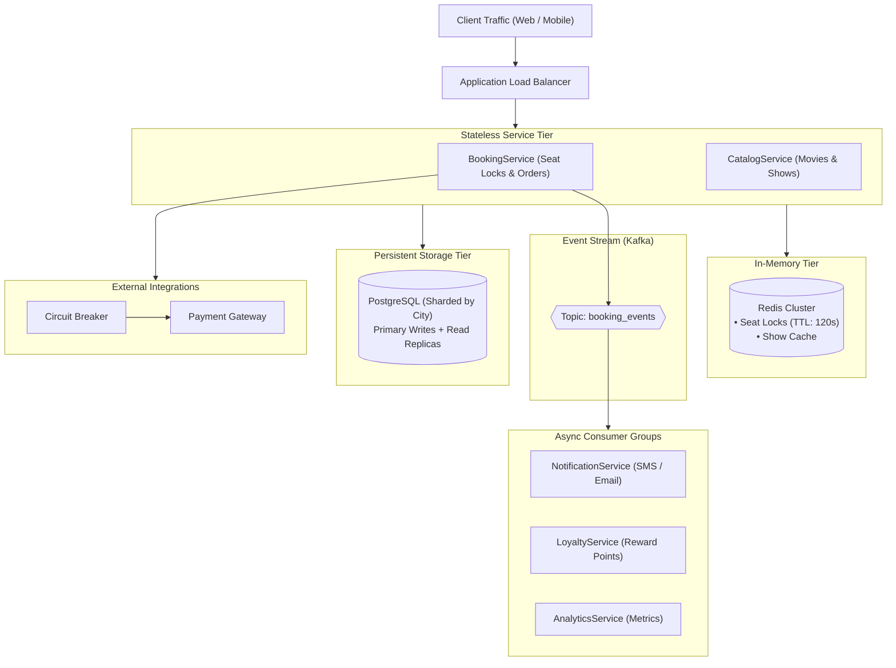

# Movie Booking System — High-Level Design (HLD)

A scalable, fault-tolerant distributed system architecture for a high-concurrency movie ticket booking platform (e.g., BookMyShow). Designed to handle peak flash-crowd traffic during blockbuster releases with zero double-bookings, low latency browsing, and resilient asynchronous processing.

---

## Architecture Documents

The system architecture and technical specifications are organized into two modular directories:

### Advanced Concurrency & Scaling (`scaling-and-concurrency/`)

| Document | Formats | Overview |
| :--- | :---: | :--- |
| **Seat Locking & Concurrency** | [PDF](scaling-and-concurrency/Seat_Locking_Design.pdf) · [MD](scaling-and-concurrency/Seat_Locking_Design.md) | Distributed seat locking using Redis `SETNX`, 120s TTL auto-release, sequence diagrams, and idempotency guarantees. |
| **Caching Strategy** | [PDF](scaling-and-concurrency/Caching_Strategy.pdf) · [MD](scaling-and-concurrency/Caching_Strategy.md) | Cache-Aside pattern, city-partitioned Redis cluster topology, short 10s TTL for live seat layouts, and stale data mitigation. |
| **Asynchronous Processing** | [PDF](scaling-and-concurrency/Async_Workflow.pdf) · [MD](scaling-and-concurrency/Async_Workflow.md) | Kafka event bus (`booking_events`), consumer group decoupling, exponential retries, Dead-Letter Queues (DLQ), and deduplication. |
| **Scaling & Fault Tolerance** | [PDF](scaling-and-concurrency/Scaling_and_Fault_Tolerance.pdf) · [MD](scaling-and-concurrency/Scaling_and_Fault_Tolerance.md) | Horizontal app scaling behind ALB, PostgreSQL city-based sharding, circuit breaker failover, and quorum write replication. |
| **Monitoring & SLOs** | [PDF](scaling-and-concurrency/Monitoring_and_SLOs.pdf) · [MD](scaling-and-concurrency/Monitoring_and_SLOs.md) | Core observability metrics, Prometheus & Grafana stack, and service level objectives (p95 booking latency < 2.0s). |

### Core System Specifications (`architecture-specs/`)

| Document | Format | Overview |
| :--- | :---: | :--- |
| **Architecture Diagram** | [PDF](architecture-specs/Architecture_Diagram.pdf) | End-to-end distributed system architecture, component boundaries, and network topology. |
| **Component Descriptions** | [PDF](architecture-specs/Component_Descriptions.pdf) | Granular responsibilities, communication protocols, and scaling mechanisms for each microservice. |
| **API Specifications** | [PDF](architecture-specs/API_Specifications.pdf) | Production REST/gRPC API contracts, payload schemas, query parameters, and error status codes. |
| **CAP Theorem Trade-Offs** | [PDF](architecture-specs/CAP_Tradeoffs.pdf) | Analysis of AP (Availability) vs CP (Consistency) trade-offs across read and write subsystems. |
| **Scaling and Monitoring** | [PDF](architecture-specs/Scaling_and_Monitoring.pdf) | Flash-crowd mitigation, virtual queueing, database sharding, and end-to-end observability. |

---

## Core System Architecture

---

## Key Design Decisions

1. **Distributed Seat Locking:** Temporary seat holds use Redis atomic `SET seat:{show_id}:{seat_id} {user_id} NX EX 120`. This ensures sub-millisecond lock acquisition and eliminates heavy database row contention. Expired holds auto-release at 120 seconds.
2. **Two-Tiered Caching:** Show details are cached for 300 seconds using the Cache-Aside pattern. Seat availability maps use a short 10-second TTL to balance database read protection with UI freshness, while the atomic Redis lock acts as the single source of truth.
3. **Decoupled Checkout Path:** Post-booking operations (SMS tickets, loyalty points, analytics logs) run asynchronously through Kafka topic `booking_events`. Consumers process messages independently with exponential retries and dead-letter queues (`booking_events_dlq`).
4. **City-Based Database Sharding:** PostgreSQL is horizontally sharded by `city_id`. Because movie discovery and ticket reservations are geographically localized, transactional locks and queries execute within single shards without cross-shard joins.
5. **Circuit Breakers & Observability:** Outbound calls to payment processors are wrapped with circuit breakers that fail over to backup providers during third-party outages. Prometheus and Grafana monitor latency with a strict SLO of **p95 booking completion in < 2.0 seconds**.
